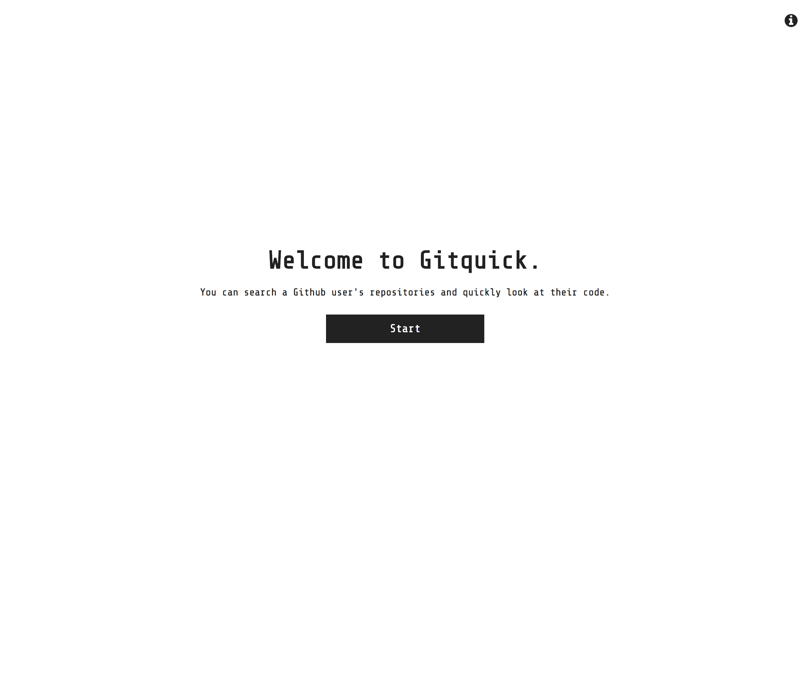
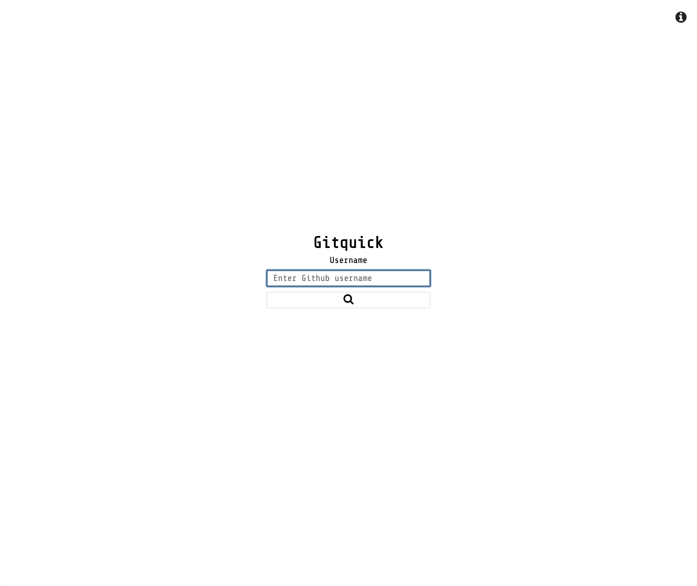
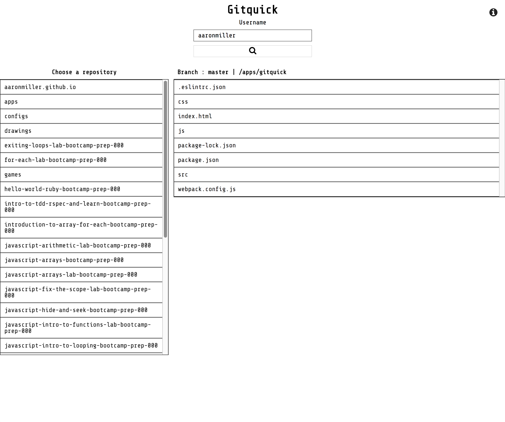
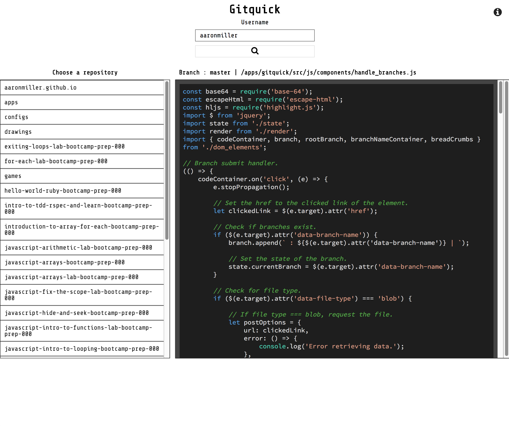

Gitquick
========

Gitquick is a small application to enhance technical interviews for software engineering by way of reviewing and discussing a candidate's code.

Instead of using Github to directly access one's code, all of files and source code will be served on a single page.

Screenshots
===========

Technologies Used
=================
### HTML
### CSS
### JavaScript
### jQuery
### Webpack/Webpack Dev Server
### NodeJS/Yarn
### Less

Project URL
===========
https://aaronmiller.github.io/apps/gitquick
